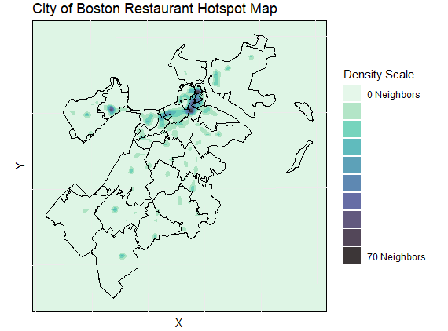
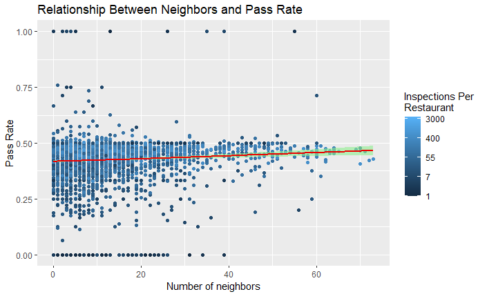

** Live geospatial analysis: **
https://giandagostino.github.io/Boston-Health-Inspections/

# Boston Health Inspections: Geospatial Analysis

Created using data from the City of Boston, I've created geospatial visualizations of the city and assessed significance of restaurant density (whether the restaurant is in an urban or suburban area) in relation to health inspection records. The health inspection records span from 2008-2025.

## Tools
- Geospatial mapping and calculations with `ggplot`, `sf`, and `tidyverse`
- Statistical techniques: K-Neighbors algorithm, χ² test, spline regression

## Results
- Urban restaurants have a higher failure rate than suburban restaurants (0.8% difference on average)
- Difference is statistically significant (χ² test, p < 0.05)
- Spline regression shows the effect persists after accounting for the variable amount of inspections per restaurant.

## Takeaways
- Restaurant location is an important correlary to health inspection outcomes, however this difference is small.
- The City Health Division should not necessarily use this association as a primary driver of policy or resource allocation decisions, but should keep it in mind when auditing health inspection procedures and training inspectors across different geographic contexts.

## Visualizations

## Data Source

Zipcode Shapefiles - https://data.boston.gov/dataset/zip-codes \
Health Inspection Records - https://data.boston.gov/dataset/food-establishment-inspections
